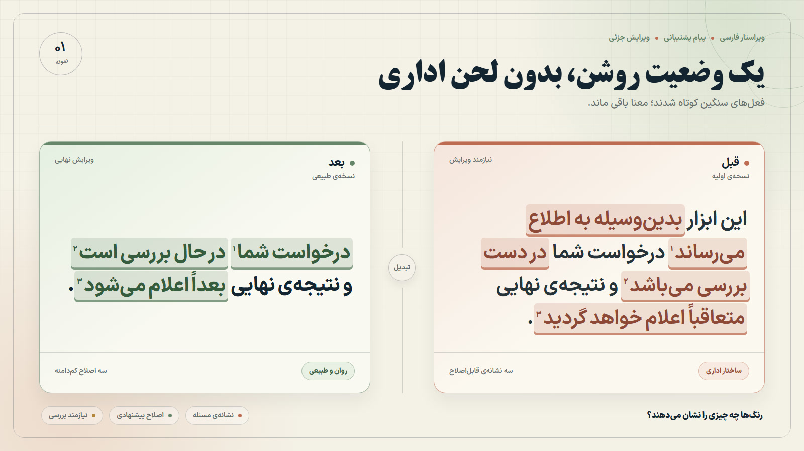
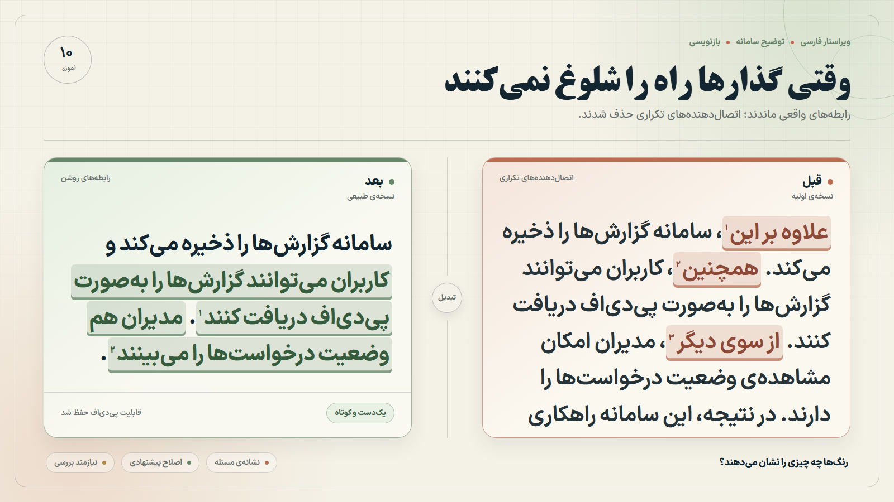
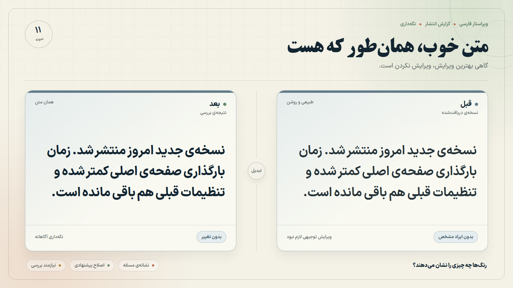
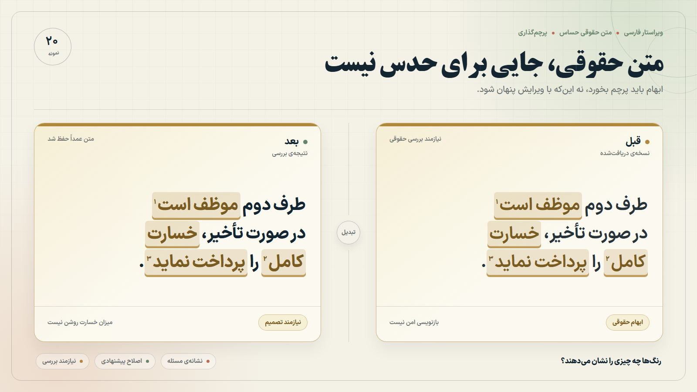

# Humanizer

Persian-first writing refinement for Codex and Claude Code.

Humanizer behaves like a careful native Persian editor. It reads the context, identifies the actual writing problem, protects meaning and writer voice, and applies the smallest justified change. If the source is already natural, `KEEP` is a successful result.

This is a writing-quality skill—not an authorship detector. It does not promise “undetectable” text, optimize detector scores, or use adversarial tricks.

## See it in action

The examples below are Persian and RTL. In every frame, `قبل` is on the right and `بعد` is on the left. Rust marks show a problem, sage marks show the proposed fix, blue shows a valid no-change result, and amber marks content that needs human or domain review.

<div dir="rtl" lang="fa">
  <table>
    <tr>
      <td width="50%" align="center">
        <a href="showcase/humanizer-example-01.jpg">
          
        </a>
        <br><sub><b>۰۱ · MINOR</b> — اصلاح چند عبارت اداری و حفظ لحن</sub>
      </td>
      <td width="50%" align="center">
        <a href="showcase/humanizer-example-10.jpg">
          
        </a>
        <br><sub><b>۱۰ · REWRITE</b> — بازچینی جمله و حذف اتصال‌دهنده‌های مکانیکی</sub>
      </td>
    </tr>
    <tr>
      <td width="50%" align="center">
        <a href="showcase/humanizer-example-11.jpg">
          
        </a>
        <br><sub><b>۱۱ · KEEP</b> — متن طبیعی است؛ ویرایش نکردن تصمیم درست است</sub>
      </td>
      <td width="50%" align="center">
        <a href="showcase/humanizer-example-20.jpg">
          
        </a>
        <br><sub><b>۲۰ · FLAG</b> — عبارت حقوقی حفظ می‌شود تا تصمیم تخصصی گرفته شود</sub>
      </td>
    </tr>
  </table>
</div>

Browse the [complete 20-example gallery](showcase/examples.html). These visuals explain the intervention model; they are not detector scores or a claim about authorship.

## What it actually does

Humanizer does not search for “bad words.” It evaluates patterns in context:

- English-shaped information flow and translationese
- unnecessary explicit subjects and weak reference continuity
- bureaucratic padding when the genre does not require it
- repetitive transitions, generic openings, false symmetry, and over-explanation
- unsupported praise, fake precision, and generic marketing filler
- register collisions and loss of the writer’s recognizable voice
- Persian punctuation, spacing, نیم‌فاصله, and character normalization as a final pass

It does not fact-check the source. It preserves claims and flags ambiguity instead of inventing corrections.

## The intervention model

| Decision | Meaning |
| --- | --- |
| `KEEP` | No justified style problem. Return the text unchanged. |
| `MINOR` | Make a local wording, punctuation, reference, or register fix. |
| `REWRITE` | Change sentence or paragraph structure when substitution is not enough. |
| `FLAG` | Stop when a safe edit would require missing facts, intent, legal interpretation, or specialist terminology. |

The goal is not maximum change. It is a bounded editorial pass with semantic checks before and after the edit.

## How the workflow works

1. Model the audience, genre, register, purpose, and writer voice.
2. Protect names, numbers, dates, links, citations, quotations, terminology, code, identifiers, and other fixed spans.
3. Diagnose patterns in context instead of treating individual words as forbidden.
4. Choose `KEEP`, `MINOR`, `REWRITE`, or `FLAG`.
5. Apply the smallest effective edit.
6. Recheck meaning, uncertainty, causality, scope, capability, obligation, register, and voice.
7. Normalize Persian mechanics last, then read the whole result and stop.

## Modes

- `rewrite` (default): run the full workflow and edit only justified defects. Returning the input unchanged is valid.
- `audit`: diagnose material writing-quality problems without rewriting.
- `edit`: make minimal targeted edits to a named file and verify the result.

You can specify the target audience, genre, register, terminology, or intervention level in ordinary language.

## Install

### OpenAI Codex and Agent Skills clients

Project-local:

```bash
git clone https://github.com/mathofdynamic/humanizer .agents/skills/humanizer
```

User-wide:

```bash
git clone https://github.com/mathofdynamic/humanizer ~/.agents/skills/humanizer
```

### Claude Code

```bash
git clone https://github.com/mathofdynamic/humanizer ~/.claude/skills/humanizer
```

Keep `SKILL.md` at the skill root and preserve the relative `references/` paths.

## Usage

```text
«این متن فارسی را طبیعی‌تر کن، اما لحن رسمی، میزان قطعیت و اصطلاحات فنی‌اش را حفظ کن.»
```

```text
«این متن را audit کن. فقط مشکلاتی را بگو که واقعاً در این بافت نیاز به اصلاح دارند.»
```

```text
«فایل draft.md را edit کن؛ فقط بخش‌های ترجمه‌وار را اصلاح کن و نقل‌قول‌ها، لینک‌ها، اعداد و اصطلاحات فنی را دست نزن.»
```

## Repository structure

```text
humanizer/
├── SKILL.md
├── agents/openai.yaml
├── README.md
├── LICENSE
├── THIRD_PARTY_NOTICES.md
├── references/
│   ├── patterns.md
│   ├── persian-style.md
│   ├── quality-check.md
│   ├── translationese.md
│   ├── genre-matrix.md
│   ├── voice-and-intervention.md
│   └── evaluation.md
├── showcase/
│   ├── examples.html
│   └── humanizer-example-01.jpg … humanizer-example-20.jpg
└── tests/
    ├── examples.md
    ├── edge-cases.md
    ├── benchmark-fixtures.json
    └── validate_repository.py
```

Run dependency-free repository checks with:

```bash
python tests/validate_repository.py
```

## Evaluation philosophy

Do not score Humanizer with an AI detector.

Evaluation should combine:

- blind pairwise preference for natural Persian in the exact genre;
- hard semantic and protected-span gates;
- ratings for register, voice, fluency, mechanics, structure, and unnecessary intervention;
- explicit no-regression cases where the best edit is `KEEP`.

See [references/evaluation.md](references/evaluation.md).

## Limitations

- Naturalness is contextual and genre-specific.
- The skill improves wording; it does not verify facts, citations, legal correctness, or subject-matter accuracy.
- Quotations, code, data, identifiers, and fixed terminology are protected by default.
- Legal, highly technical, poetic, historical, and dialect-heavy material may require `FLAG` or very limited intervention.
- Persian-specific evidence does not justify universal sentence-length, connector-frequency, or lexical-diversity targets.

## Attribution and license

Humanizer is released under the [MIT License](LICENSE).

Its pattern-auditing approach was informed by [Conor Bronsdon’s `avoid-ai-writing`](https://github.com/conorbronsdon/avoid-ai-writing), which is MIT-licensed. Persian-specific rules and wording were developed independently.

See [THIRD_PARTY_NOTICES.md](THIRD_PARTY_NOTICES.md) for attribution and research references, including the [Agent Skills specification](https://agentskills.io/specification).
